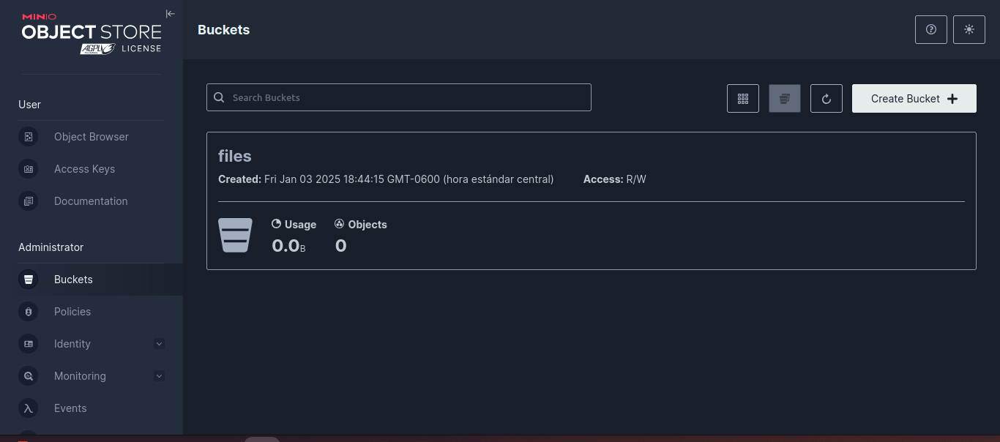

# Minio
## ¿Que es minio?
MinIO es un servidor de almacenamiento de objetos compatible con Amazon S3, diseñado para almacenar datos no estructurados como archivos,imagenes,videos,musica,etc
a parte es de codigo abierto! esto si desea buscar una alternativa a s3 pero que sea gratuito y como podemos ver en las siguientes imagenes tiene la misma tematica de s3 de gestionar por buckets los almacenamientos.



## Instalacion
``` bash
wget https://dl.min.io/server/minio/release/linux-amd64/minio
```
una vez generado y descargado la carpeta asiganamos permisos de ejecucion
``` bash
chmod +x minio
```
Movemos a un directorio adecuado como puede ser bin para los binarios
``` bash
mv minio /usr/local/bin/
```
Luego crearemos un servicio para ejecutarlo como demonio en segundo plano
``` bash
nano /etc/systemd/system/minio.service
```
Dentro del archivo minio.service añadimos las siguientes intrucciones:
```bash
[Unit]
Description=MinIO
Documentation=https://docs.min.io
After=network.target

[Service]
ExecStart=/usr/local/bin/minio server /mnt/data
Restart=always
User=root
Group=root
EnvironmentFile=-/etc/default/minio
LimitNOFILE=65536

[Install]
WantedBy=multi-user.target

```
#### Creacion de almacenamiento para la data de minio
``` bash
sudo mkdir -p /mnt/data
sudo chown root:root /mnt/data
```
#### Recargamos los servicio de systemd y minio
``` bash
systemctl daemon-reload
systemctl enable minio
systemctl start minio
```
Para verificar accedemos a nuestra ip de nuestro servidor seguido del puerto :9000 que es el por defecto


