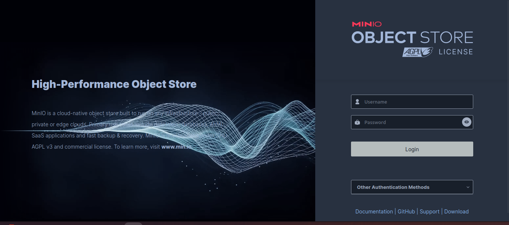

# Minio
## ¿Que es minio?
MinIO es un servidor de almacenamiento de objetos compatible con Amazon S3, diseñado para almacenar datos no estructurados como archivos,imagenes,videos,musica,etc
a parte es de codigo abierto! esto si desea buscar una alternativa a s3 pero que sea gratuito.

